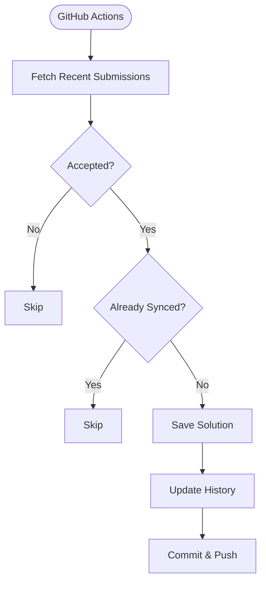

# Codeforces Archive

Automatically synchronizes accepted **Codeforces** submissions to GitHub using **GitHub Actions**.

## ⚙️ Architecture



## 📂 Repository Structure

```text
.
├── .github/
│   └── workflows/
│       └── codeforces_commit.yml
├── submissions/
├── fetch_submission.py
├── submission_history.json
└── README.md
```

## ✨ Features

* Automatically syncs newly accepted Codeforces submissions
* Runs every 15 minutes via GitHub Actions
* Prevents duplicate uploads using submission history
* Preserves the correct file extension for each programming language
* Supports manual workflow execution from GitHub Actions

## 💻 Supported Languages

Works with all major languages supported by Codeforces, including:

* C++
* Python
* Java
* Kotlin
* Go
* Rust
* JavaScript
* TypeScript
* C#
* PHP
